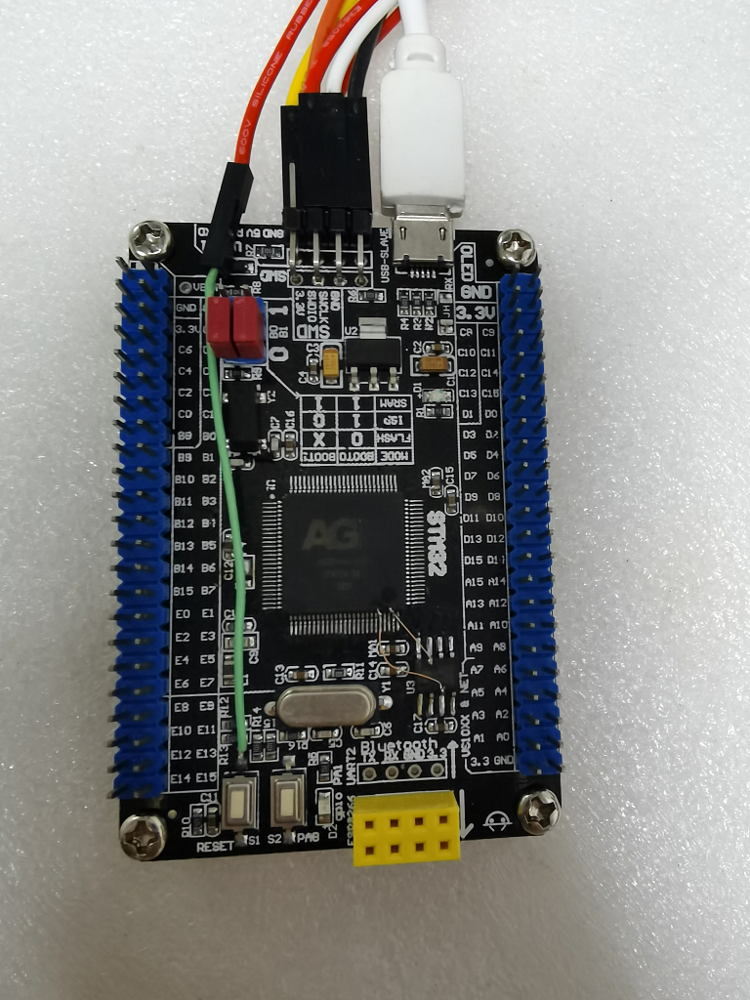

# AGRV2K裸奔测试工程

AGRV2K(AG32VF407)，内置主频可达240M的RISC-V，并自带2K的FPGA逻辑，很适合做一些小规模的逻辑产品。
它的价格更是只有16.8元，十分良心。

AGRV2K的FPGA开发流程稍微有点复杂。它需要先用第三方工具(比如Quartus)进行综合，输出网表文件，然后再由
它自己的Supra工具进行转换与布线等，最后输出可下载的bin文件。

官方推出的开发环境是VSCode+PlatformIO，里面有各种MCU和FPGA的例子可供学习研究。它的下载工具可以使用USB-Blaster，也可以使用两线的JLink等，还算方便的。但AGM的开发资料比较混乱。各种零碎的文档混合在一起，需要你慢慢的去发掘。

------
本工程基于裸奔原则，只用Makefile来做MCU与FPGA的开发，给你带来清爽的感觉。

开发板:  
　　是用某STM32F407板子直接改的。AGRV32和STM32F407是引脚兼容的，可以直接替换。  
　　

MCU部分:  
　　初始化串口与时钟，跑起一个简单的串口shell，可以读写地址做各种测试。  
　　可以coremark跑分。  
FPGA部分:  
　　实现了简单的AHB接口，可以访问FPGA上的外设寄存器。  
　　实现了简单的SPI PSRAM控制器。  

如何编译:  
　　MCU:  
　　　　make  
　　　　make dl  
　　FPGA:  
　　　　cd fpga  
　　　　make proj  
　　　　用quatrus打开工程，tools->tcl script->af_quartus.tcl，完成编译。  
　　　　make genbin  
　　　　make dl  

------
### FPGA开发主意事项:

- 第一步是编辑ve文件。 这一步可参考文档《AGRV2k逻辑设置.pdf》。但这个文档写的还是不太完全，还有些关于PLL的功能没写。更完全的文档要看tools/gen_vlog这个文档。

- 有时候MCU程序跑飞了，此时openocd会连接不上。此时需要把NRST脚连接到JLink，就可以连接上了。

- MCU主频240M，据说可以跑到300M以上。但与FPGA相连的AHB接口与MCU是同频的，太高的频率会导致各种时序问题。所以建议MCU跑个200M就差不多了。

- 测试中发现，在verilog中直接把clk输出到引脚(assign clk_out = bus_clk)会导致Supra崩溃。变通的做法是在VE文件中直接把PLL时钟指定到引脚。或者用AGM提供的IP来输出？

- 待续......

------
### 一些关于AGM的逆向的项目:
- https://github.com/pablomarx/rodinia  
AGM bitstream utilities and decoded files from Supra 

- https://github.com/gabonator/Education/tree/master/2021/AltaGateReverse  
Alta-gate Supra reverse engineering
